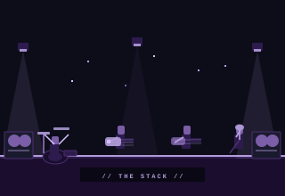

  

  

  
  
  

 

---

  

 

---

<h2 align="center">
  
</h2>

<table align="center" border="0">
  <tr>
    <td align="center" valign="top" width="200">
        
      
    </td>
    <td align="center" valign="top" width="200">
        
      
    </td>
    <td align="center" valign="top" width="200">
        
      
    </td>
    <td align="center" valign="top" width="200">
        
      
    </td>
  </tr>
</table>

 

---

<h2 align="center">
  
</h2>

  
  

  

  

 

---

<h2 align="center">
  
</h2>

  
  
  
  
  
  

 

  

