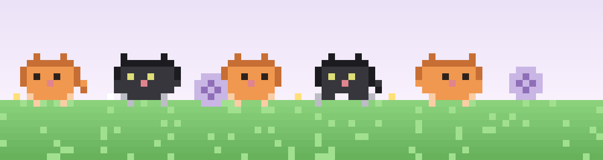

<!-- ============================== HEADER ============================== -->

  

  

  
  
  

 

<!-- ============================== CATS BANNER ============================== -->

  

 

<!-- ============================== INFO ============================== -->

  Frontend Developer focused on <b>React</b> and <b>Next.js</b> 
  Currently learning <b>Python</b> for scripting and automation 
  Aspiring <b>Network Engineer</b>, starting from the fundamentals 
  Stack: React, Next.js, Node.js, ASP.NET 
  Reach me at <b>marklegend029@gmail.com</b>

 

<!-- ============================== TECH STACK ============================== -->
<h2 align="center">Tech Stack</h2>

<table align="center">
  <tr>
    <td align="center" valign="top" width="240">
      <strong>Frontend</strong>  
      
    </td>
    <td align="center" valign="top" width="240">
      <strong>Backend</strong>  
      
    </td>
    <td align="center" valign="top" width="240">
      <strong>Databases</strong>  
      
    </td>
    <td align="center" valign="top" width="240">
      <strong>Tools</strong>  
      
    </td>
  </tr>
</table>

 

<!-- ============================== CURRENTLY LEARNING ============================== -->
<h2 align="center">Currently Learning</h2>

  
  
  
  

<table align="center">
  <tr>
    <th>Topic</th>
    <th>Status</th>
  </tr>
  <tr>
    <td>Networking Fundamentals</td>
    <td>Completed</td>
  </tr>
  <tr>
    <td>IPv4 Subnetting</td>
    <td>Completed</td>
  </tr>
  <tr>
    <td>Python for Scripting</td>
    <td>In Progress</td>
  </tr>
  <tr>
    <td>VLANs and Switching</td>
    <td>In Progress</td>
  </tr>
  <tr>
    <td>CCNA Certification</td>
    <td>In Progress</td>
  </tr>
  <tr>
    <td>Routing Protocols (OSPF / BGP)</td>
    <td>Planned</td>
  </tr>
  <tr>
    <td>Network Security Fundamentals</td>
    <td>Planned</td>
  </tr>
</table>

 

<!-- ============================== GITHUB STATS ============================== -->
<h2 align="center">GitHub Stats</h2>

  
  

  

  

 

<!-- ============================== CONNECT ============================== -->
<h2 align="center">Connect With Me</h2>

  
  
  
  

<!-- ============================== FOOTER ============================== -->

  

